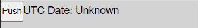
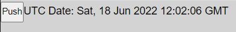
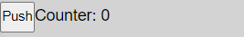
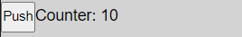
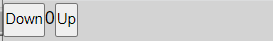
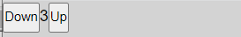
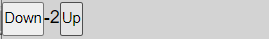

# JavaScript React Intro Assignments 2

# Ex. 1: Date Fetcher
Create a React component called `DateFetcher`.  The `DateFetcher` has a state variable that is used to store the UTC date.  When the `DateFetcher` is initially loaded into the browser it displays the following:



When the button is pushed, the current date in UTC format is displayed.  Example:




Place this component in your Main component in your Student directory:

```
export const Main = () => {
  return (
    <DateFetcher />
  )
}
```

Always keep the DevTools console open (Ctl+Shift+I) and remove any errors or warnings.

When you are finished create a PR with the following title: `Ex. 1: Date Fetcher`.

# Ex. 2 Ten Counter
Create a React component called `TenCounter` that displays the number of times a button has been pushed.  When the counter reaches the value of 10, it resets to 0.






Place this component in your Main component in your Student directory:

```
export const Main = () => {
  return (
    <TenCounter />
  )
}
```

Always keep the DevTools console open (Ctl+Shift+I) and remove any errors or warnings.

When you are finished create a PR with the following title: `Ex. 3: Up Down Counter`.

# Ex. 3 Up Down Counter
Create a React component called `UpDownCounter` that increments or decrements the value of the counter.  This component should have one state variable and one button handler function.







Place this component in your Main component in your Student directory:

```
export const Main = () => {
  return (
    <UpDownCounter />
  )
}
```


Always keep the DevTools console open (Ctl+Shift+I) and remove any errors or warnings.

When you are finished create a PR with the following title: `Ex. 3: Up Down Counter`.

# Ex. 4


# Ex. 5


# Ex. 6


# Ex. 7


# Ex. 8


# Ex. 9


# Ex. 10